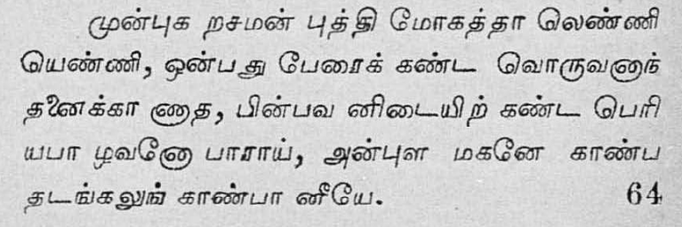
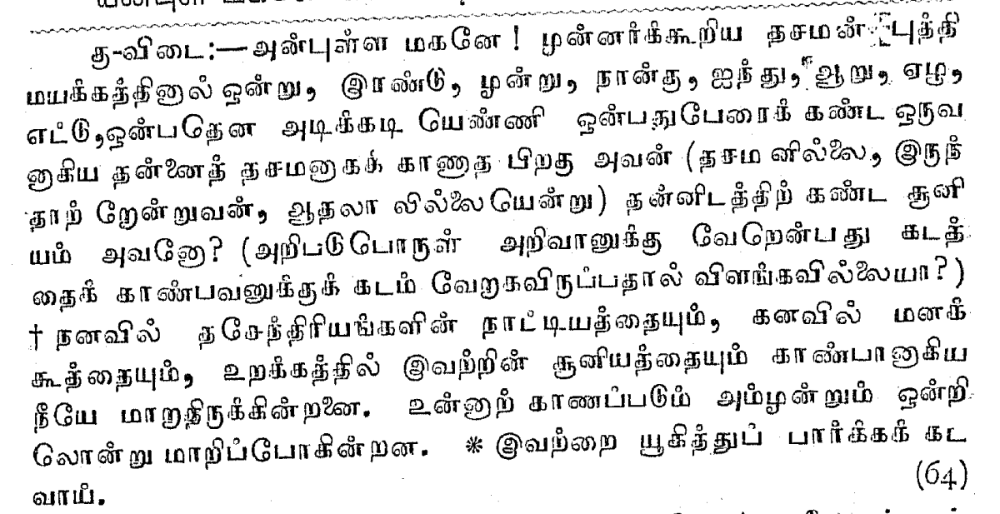
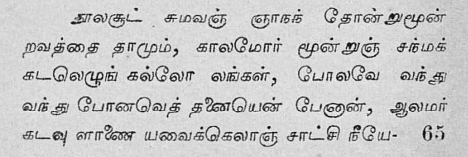
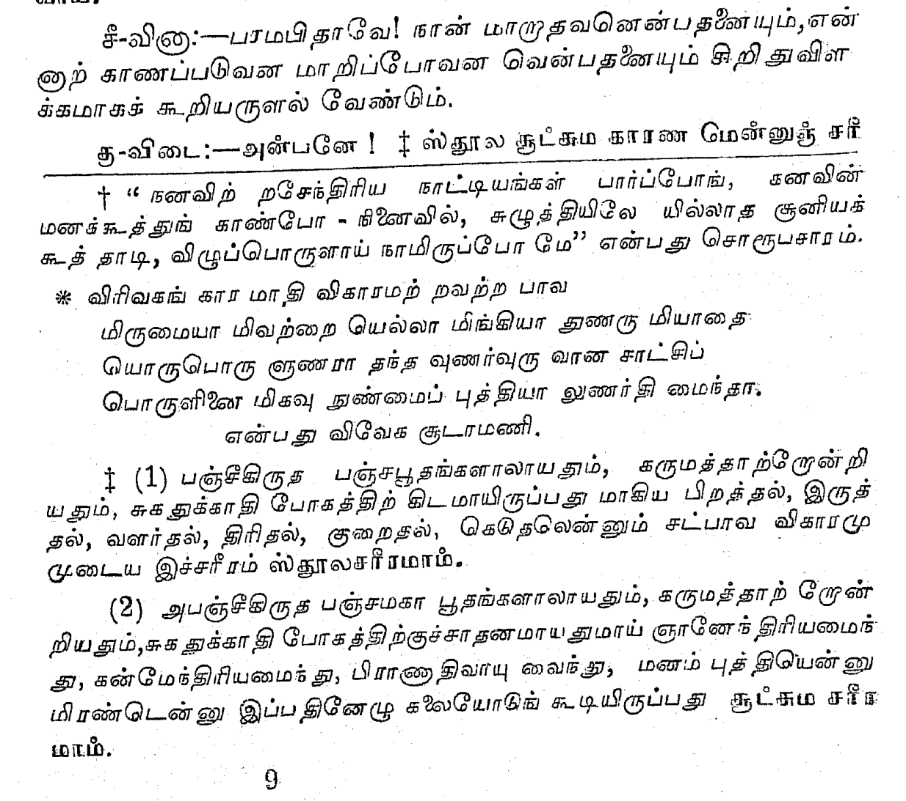
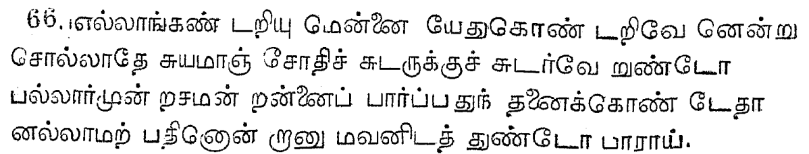
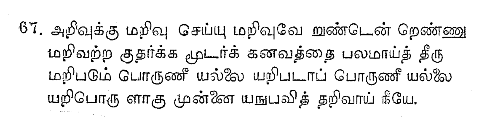

title:: kvn_63_67

- 
- எண்ணி
- அவன் இல்லைனு நினைச்சது அவன ?
- என்னக்கு நாக்கே இல்ல
- காண்பது அடங்கல்
- காண்பான் நீயே
- இன் டீப் ஸ்லீப்
- in deep sleep, நீ இருக்கியா இல்லை இல்லயா
- நீ சத்து
- can you see your eyes with your own eyes?
	- just cannot
	- like that you see/know everything but cannot see yourselves
	- just experience it - ITS OK
	- but don't try to understand it - YOU CANNOT
	- ~~~~
- 
	- stop the want to "experience" I.. you need to stop it
	- உண்ண நீ பாக்க முடியாது
	- பாக்க அவசியம் இல்லை
-
- 
- 
	- கல்லோலம் - அலை
	- ஜெனமாவே கடல் போல இருக்கு
	- கடலே எப்படி அலைகள் வந்து வந்து போகின்றதொ
	- அதே போல ஜென்மங்கள்
	- [புத்தர் ஜாதாகர் பிறவி] போதி ஜென்மா
- 
	- அபாவ சாட்சி
	- சுக சாட்சி துக்க சாட்சி
	- you are the observer, not the you
	- to understand light there is no need for another light
- 
	- என்னை நான் அறிகிறேன் என்று
		- recursion
	-
-